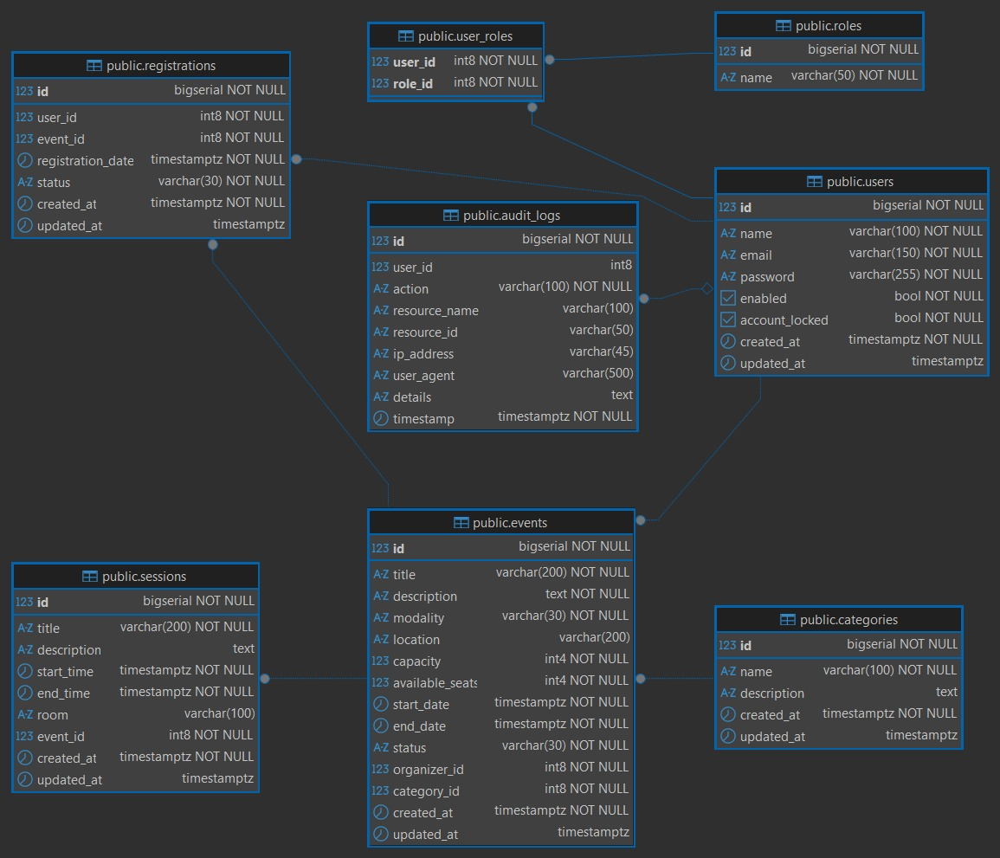
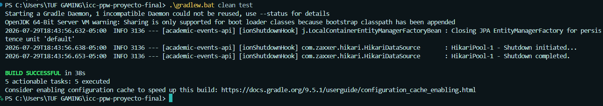
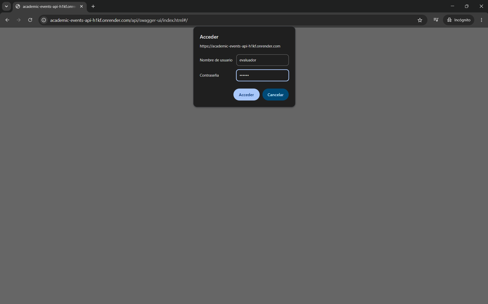
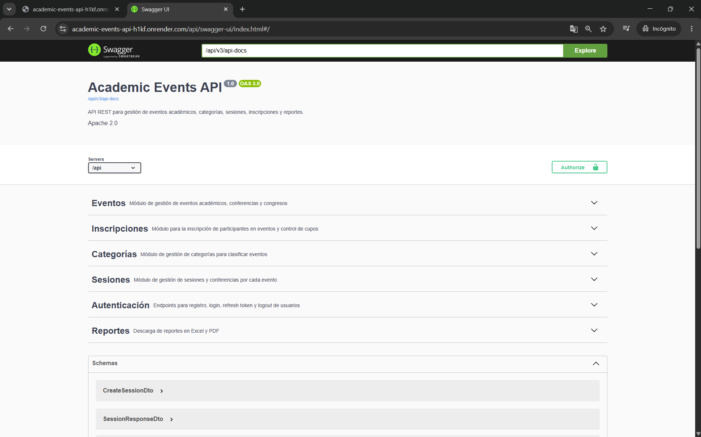
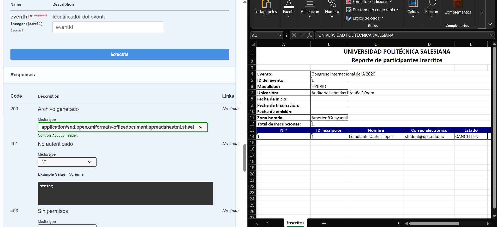
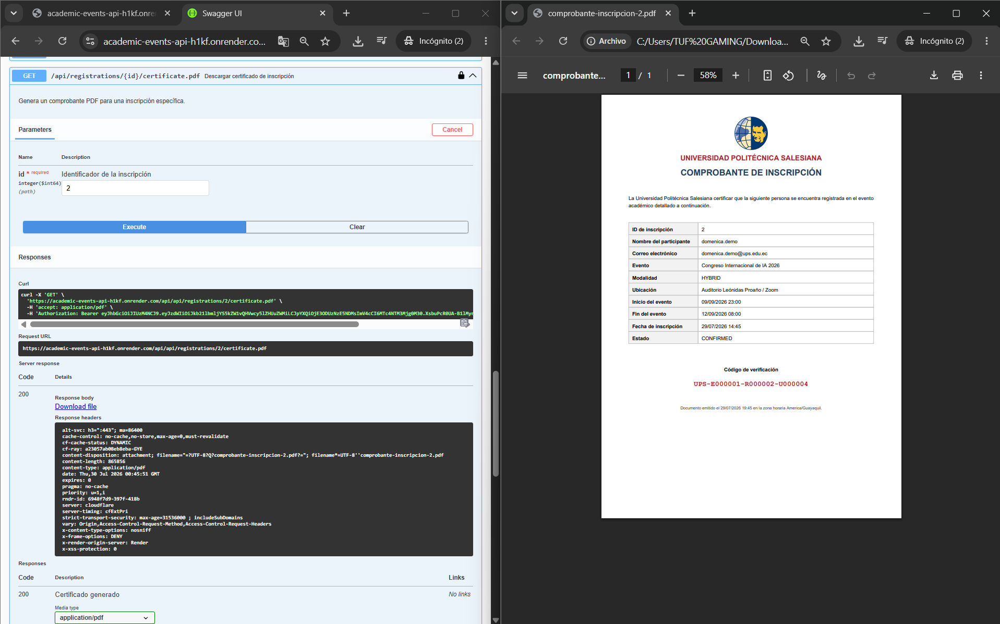
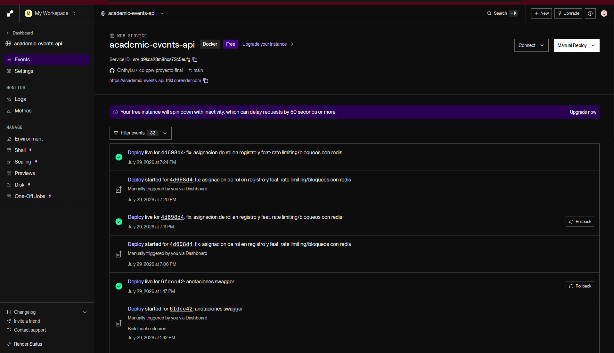
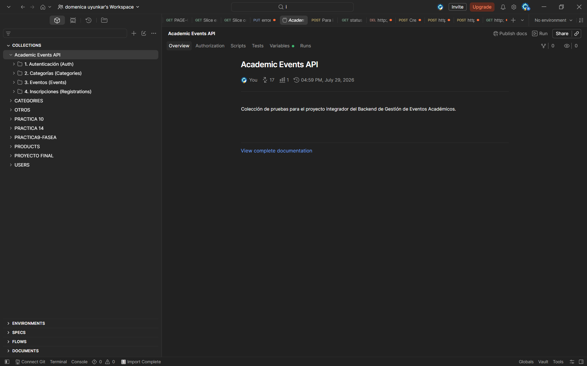

# API REST de Gestión de Eventos Académicos

Backend desarrollado con **Java 17**, **Spring Boot 3.3.4**, **PostgreSQL** y **Redis** para administrar eventos académicos, categorías, sesiones, inscripciones, auditoría, seguridad y reportes descargables.

## Integrantes

| Integrante | Correo institucional | GitHub |
|---|---|---|
| Cinthya Ramón | cramonm1@est.ups.edu.ec | [CinthyLu](https://github.com/CinthyLu) |
| Domenica Uyunkar | duyunkar@est.ups.edu.ec | [dome323](https://github.com/dome323) |
| Josué Valdez | jvaldezl1@est.ups.edu.ec | [Josuelv14](https://github.com/Josuelv14) |

## Enlaces del proyecto

- **Repositorio:** https://github.com/CinthyLu/icc-ppw-proyecto-final
- **Backend desplegado en Render:** https://academic-events-api-h1kf.onrender.com
- **Swagger UI:** https://academic-events-api-h1kf.onrender.com/api/swagger-ui/index.html#/
- **Health Check:** https://academic-events-api-h1kf.onrender.com/api/actuator/health
- **Video de presentación:** [Ver video](PEGAR_AQUI_EL_ENLACE_DEL_VIDEO)

## Credenciales de evaluación

> Las siguientes cuentas fueron creadas exclusivamente para las pruebas y la evaluación académica del proyecto.

### Acceso a Swagger — Basic Auth

```text
Usuario: evaluador
Contraseña: ups123
```

### Inicio de sesión con usuario administrador

```text
Usuario: PENDIENTE_USUARIO_ADMIN
Contraseña: PENDIENTE_CONTRASEÑA_ADMIN
```

### Inicio de sesión con usuario participante

```text
Usuario: domenica.demo@ups.edu.ec
Contraseña: Demo12345!
```
Las credenciales incluidas en este README corresponden únicamente a cuentas de demostración para la evaluación.

El acceso Basic Auth de Swagger y el inicio de sesión de la API son autenticaciones diferentes.

Primero se debe ingresar a Swagger con las credenciales Basic Auth. Después, para ejecutar los endpoints protegidos, se debe iniciar sesión mediante:

```text
POST /api/auth/login
```

El endpoint de login devuelve un token JWT, el cual debe colocarse en el botón **Authorize** de Swagger.

> Después de finalizar la evaluación, se recomienda cambiar o eliminar las credenciales de prueba publicadas en este documento.

## Funcionalidades principales

- Registro e inicio de sesión con JWT.
- Renovación de tokens mediante Refresh Token.
- Cierre de sesión con invalidación de tokens en Redis.
- Control de acceso por roles: `ADMIN`, `ORGANIZER` y `PARTICIPANT`.
- Gestión de categorías, eventos y sesiones.
- Validación de propiedad de eventos para organizadores.
- Inscripciones con control transaccional de cupos.
- Prevención de inscripciones duplicadas.
- Prevención de sobreventa de cupos.
- Auditoría de operaciones relevantes.
- Rate limiting y protección frente a intentos repetidos.
- Reportes de inscritos en Excel y PDF.
- Certificados individuales en PDF.
- Documentación OpenAPI mediante Swagger UI.
- Despliegue mediante Docker y Render.

## Arquitectura

El proyecto utiliza una arquitectura monolítica modular organizada por dominios.

Cada módulo separa controladores, DTOs, mapeadores, repositorios, servicios e implementaciones.

```text
src/main/java/ec/edu/ups/icc/events/
├── audit/
├── auth/
├── categories/
├── core/
├── events/
├── registrations/
├── reports/
├── security/
├── sessions/
└── users/
```

Los servicios se definen mediante interfaces y clases `*ServiceImpl`, reduciendo el acoplamiento y facilitando las pruebas y el mantenimiento del sistema.

## Tecnologías

| Tecnología | Uso |
|---|---|
| Java 17 | Lenguaje principal |
| Spring Boot 3.3.4 | Framework backend |
| Spring Security | Autenticación y autorización |
| JWT | Access Token y Refresh Token |
| Spring Data JPA / Hibernate | Persistencia |
| PostgreSQL | Base de datos relacional |
| Redis | Blacklist de tokens, bloqueos y rate limiting |
| Apache POI | Generación de reportes Excel |
| OpenPDF | Generación de reportes y certificados PDF |
| Gradle Kotlin DSL | Gestión de dependencias |
| Docker / Docker Compose | Contenedores locales |
| Render | Despliegue en la nube |
| Swagger / OpenAPI | Documentación interactiva |
| Postman | Pruebas manuales de endpoints |

## Modelo de base de datos

El siguiente diagrama fue generado a partir del esquema PostgreSQL del proyecto:



Entidades principales:

- `users`
- `roles`
- `user_roles`
- `categories`
- `events`
- `sessions`
- `registrations`
- `audit_logs`

## Configuración

Las credenciales de infraestructura y los datos sensibles deben configurarse mediante variables de entorno.

Variables relevantes para Swagger en producción:

```env
SPRING_PROFILES_ACTIVE=prod
SWAGGER_USER=usuario_configurado
SWAGGER_PASSWORD=contraseña_configurada
```

También se utilizan variables de entorno para configurar:

- PostgreSQL.
- Redis.
- CORS.
- Seguridad JWT.
- Perfil activo de Spring.


## Ejecución local

### Requisitos

- Java 17.
- Docker Desktop.
- Git.

### 1. Clonar el repositorio

```bash
git clone https://github.com/CinthyLu/icc-ppw-proyecto-final.git
cd icc-ppw-proyecto-final
```

### 2. Levantar PostgreSQL y Redis

```bash
docker compose up -d postgres redis
```

### 3. Ejecutar las pruebas

En Windows:

```powershell
.\gradlew.bat clean test
```

En Linux o macOS:

```bash
./gradlew clean test
```

### 4. Iniciar la API

En Windows:

```powershell
.\gradlew.bat bootRun
```

En Linux o macOS:

```bash
./gradlew bootRun
```

### 5. Abrir Swagger local

```text
http://localhost:8080/api/swagger-ui/index.html#/
```

## Seguridad de Swagger

En el entorno de producción, Swagger está protegido mediante autenticación Basic.

Comportamiento esperado:

- Sin credenciales válidas: `HTTP 401 Unauthorized`.
- Con credenciales válidas: `HTTP 200 OK`.

Las credenciales se obtienen de las siguientes variables de entorno:

```env
SWAGGER_USER
SWAGGER_PASSWORD
```

La protección de Swagger es diferente a la autenticación JWT utilizada por los usuarios de la API.

## Autenticación de usuarios

El sistema utiliza JWT para proteger los endpoints privados.

Endpoints principales:

```text
POST /api/auth/register
POST /api/auth/login
POST /api/auth/refresh
POST /api/auth/logout
```

Proceso de autenticación:

1. El usuario inicia sesión mediante `POST /api/auth/login`.
2. El sistema valida las credenciales.
3. Se genera un `accessToken`.
4. También se genera un `refreshToken`.
5. El `accessToken` se utiliza para acceder a los endpoints protegidos.
6. El cierre de sesión invalida el token mediante Redis.

## Roles y permisos

### ADMIN

Puede administrar los recursos del sistema y acceder a los reportes completos.

### ORGANIZER

Puede administrar sus propios eventos y descargar los reportes de los eventos que le pertenecen.

### PARTICIPANT

Puede consultar eventos, inscribirse y descargar el certificado correspondiente a su propia inscripción.

## Control de inscripciones

El sistema implementa control transaccional para prevenir errores de concurrencia.

Antes de registrar una inscripción se verifica:

- Que el evento exista.
- Que el evento se encuentre publicado.
- Que existan cupos disponibles.
- Que el participante no esté inscrito previamente.
- Que la operación se ejecute dentro de una transacción.

Se utiliza bloqueo pesimista para evitar que varios participantes ocupen simultáneamente el último cupo disponible.

## Reportes descargables

Endpoints principales:

```text
GET /api/reports/events/{eventId}/registrations.xlsx
GET /api/reports/events/{eventId}/registrations.pdf
GET /api/registrations/{id}/certificate.pdf
```

### Reporte Excel

Permite descargar la lista de inscritos de un evento en formato `.xlsx`.

El archivo es generado mediante Apache POI e incluye:

- Información del evento.
- Datos de los participantes.
- Estado de las inscripciones.
- Fechas formateadas.
- Encabezados y estilos.
- Ajuste automático de columnas.

### Reporte PDF

Permite descargar la lista de inscritos de un evento en formato PDF.

### Certificado individual

Permite que el participante descargue el certificado correspondiente a su inscripción.

El certificado incluye:

- Logo institucional.
- Datos del participante.
- Nombre del evento.
- Estado de la inscripción.
- Código de verificación.
- Fecha de emisión.
- Zona horaria de Ecuador.

Los documentos se generan directamente en memoria mediante `ByteArrayOutputStream`, evitando almacenar archivos temporales en el servidor.

Las fechas se presentan utilizando la zona horaria:

```text
America/Guayaquil
```

Los reportes completos de inscritos requieren un usuario con rol `ADMIN` o un `ORGANIZER` autorizado.

El certificado individual puede ser descargado por el participante propietario de la inscripción.

## Colección de Postman

La colección se encuentra en:

`docs/postman/academic-events-api.postman_collection.json`

### Importación

1. Abrir Postman.
2. Seleccionar **Import**.
3. Elegir el archivo JSON.
4. Verificar la variable `baseUrl`.
5. Ejecutar el login para almacenar automáticamente los tokens de acceso.

La colección permite probar:

- Autenticación.
- Categorías.
- Eventos.
- Inscripciones.

La variable principal de la colección apunta al servidor desplegado:

```text
https://academic-events-api-h1kf.onrender.com/api
```

## Evidencias

### Pruebas automatizadas



### Swagger protegido en producción



### Endpoints documentados



### Reporte Excel



### Reporte PDF



### Despliegue en Render



### Colección de pruebas en Postman



## Video de presentación

El video presenta:

- Arquitectura del proyecto.
- Autenticación y seguridad.
- Reglas de negocio.
- Control transaccional de cupos.
- Gestión de eventos e inscripciones.
- Generación de reportes.
- Protección de Swagger.
- Demostración del sistema desplegado en Render.

**Enlace del video:**

[Ver presentación del proyecto](PEGAR_AQUI_EL_ENLACE_DEL_VIDEO)

## Uso académico

Proyecto desarrollado con fines académicos para la asignatura de Programación Web.