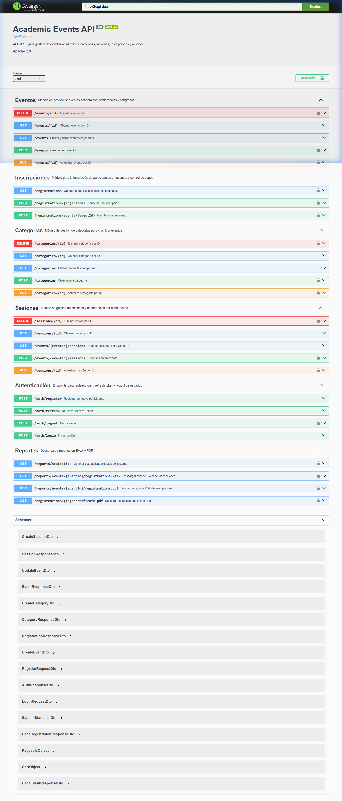
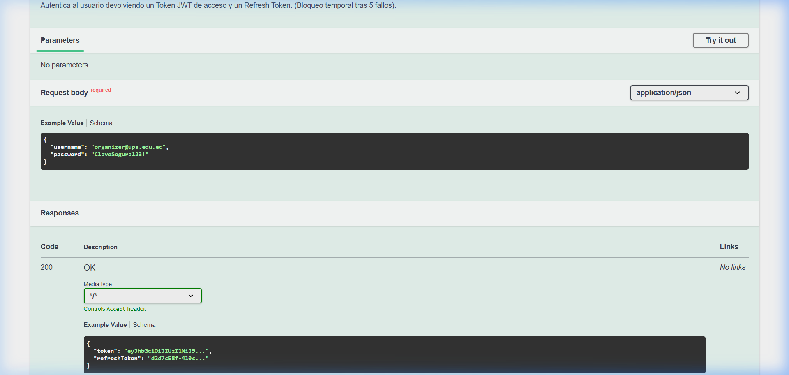
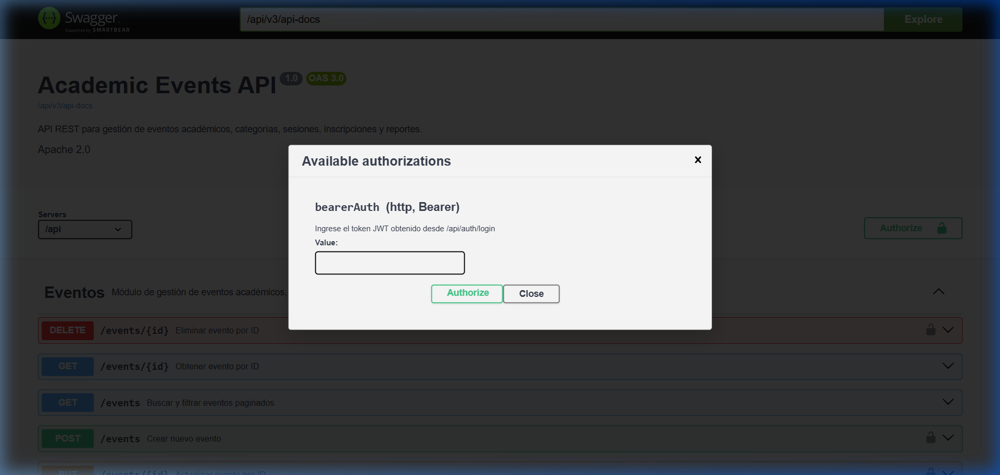
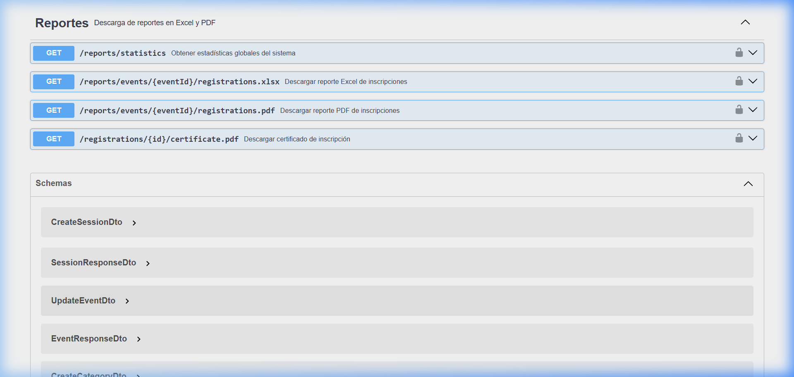

# API REST de Gestión de Eventos Académicos

Backend desarrollado con **Java 17**, **Spring Boot 3.3.4**, **PostgreSQL** y **Redis** para administrar eventos académicos, categorías, sesiones, inscripciones, auditoría, seguridad y reportes descargables.

## Integrantes

| Integrante | Correo institucional | GitHub |
|---|---|---|
| Cinthya Ramón | cramonm1@est.ups.edu.ec | [CinthyLu](https://github.com/CinthyLu) |
| Domenica Uyunkar | duyunkar@est.ups.edu.ec | [dome323](https://github.com/dome323) |
| Josué Valdez | jvaldezl1@est.ups.edu.ec | [Josuelv14](https://github.com/Josuelv14) |

## Enlaces del proyecto

- **Repositorio:** https://github.com/CinthyLu/icc-ppw-proyecto-final
- **Backend desplegado en Render:** https://academic-events-api-h1kf.onrender.com
- **Swagger UI:** https://academic-events-api-h1kf.onrender.com/api/swagger-ui/index.html#/
- **Health Check:** https://academic-events-api-h1kf.onrender.com/api/actuator/health
- **Video de presentación:** [Ver video](https://www.youtube.com/watch?v=4mKnACQPmYs)

## Credenciales de evaluación

> Las siguientes cuentas fueron creadas exclusivamente para las pruebas y la evaluación académica del proyecto.

### Acceso a Swagger — Basic Auth

```text
Usuario: evaluador

```

### Inicio de sesión con usuario administrador

```text
Usuario: admin@ups.edu.ec

```

### Inicio de sesión con usuario participante

```text
Usuario: domenica.demo@ups.edu.ec

```

El acceso Basic Auth de Swagger y el inicio de sesión de la API son autenticaciones diferentes.

Primero se debe ingresar a Swagger con las credenciales Basic Auth. Después, para ejecutar los endpoints protegidos, se debe iniciar sesión mediante:

```text
POST /api/auth/login
```

El endpoint de login devuelve un token JWT, el cual debe colocarse en el botón **Authorize** de Swagger.

> Después de finalizar la evaluación, se recomienda cambiar o eliminar las credenciales de prueba publicadas en este documento.

## Funcionalidades principales

| Funcionalidad | Descripción |
| :--- | :--- |
| **Autenticación JWT** | Registro e inicio de sesión con JWT seguros. |
| **Renovación de Tokens** | Renovación de sesiones mediante Refresh Token. |
| **Cierre de Sesión Seguro** | Cierre de sesión con invalidación de tokens en Redis. |
| **Control de Acceso (RBAC)** | Control de acceso por roles: `ADMIN`, `ORGANIZER` y `PARTICIPANT`. |
| **Gestión de Recursos** | CRUD completo de categorías, eventos y sesiones. |
| **Propiedad de Eventos** | Validación estricta de propiedad de eventos para organizadores. |
| **Inscripciones Transaccionales** | Inscripciones con control transaccional robusto y prevención de sobreventa. |
| **Prevención de Duplicados** | Validación para evitar inscripciones duplicadas de un participante. |
| **Bloqueo Concurrente** | Uso de bloqueo pesimista (`SELECT FOR UPDATE`) para control de cupos concurrentes. |
| **Auditoría Automática** | Registro detallado y automático de operaciones relevantes usando programación orientada a aspectos (AOP). |
| **Rate Limiting** | Limitación de solicitudes distribuida en Redis y protección ante intentos repetidos de acceso. |
| **Reportes Excel** | Descarga de la lista de inscritos en formato Excel (`.xlsx`) generado en memoria. |
| **Reportes PDF** | Descarga de reportes detallados en formato PDF generado bajo demanda. |
| **Certificación Digital** | Generación de certificados individuales en PDF con código único de verificación. |
| **Documentación Interactiva** | Documentación OpenAPI interactiva mediante Swagger UI. |
| **Infraestructura** | Despliegue contenerizado mediante Docker en Render. |

## Tecnologías

| Tecnología | Uso |
|---|---|
| Java 17 | Lenguaje principal |
| Spring Boot 3.3.4 | Framework backend |
| Spring Security | Autenticación y autorización |
| JWT | Access Token y Refresh Token |
| Spring Data JPA / Hibernate | Persistencia |
| PostgreSQL | Base de datos relacional |
| Redis | Blacklist de tokens, bloqueos y rate limiting |
| Apache POI | Generación de reportes Excel |
| OpenPDF | Generación de reportes y certificados PDF |
| Gradle Kotlin DSL | Gestión de dependencias |
| Docker / Docker Compose | Contenedores locales |
| Render | Despliegue en la nube |
| Swagger / OpenAPI | Documentación interactiva |
| Postman | Pruebas manuales de endpoints |

---

## Desarrollo

A continuación se detalla punto por punto el desarrollo del proyecto integrador, describiendo la implementación técnica y adjuntando las evidencias correspondientes desde el entorno de desarrollo y Swagger UI:

### 1. Arquitectura general
La API cuenta con una arquitectura monolítica modular organizada por dominio para asegurar una alta cohesión y bajo acoplamiento. Cada paquete separa controladores, DTOs, mapeadores, repositorios, entidades, servicios e implementaciones.

*Evidencia de pruebas automatizadas que validan la calidad y correcto funcionamiento del código:*


---

### 2. Modelo de datos
Se definieron las entidades JPA correspondientes al esquema de base de datos relacional PostgreSQL. Hibernate se configuró con `ddl-auto=validate` para validar que el mapeo JPA corresponda exactamente con la base de datos sin alterar su estructura en producción.

**Diagrama Entidad-Relación:**


**Entidades y Tablas Principales:**
* `users`: Almacena la información de los usuarios registrados (nombre, correo, contraseña cifrada, estado).
* `roles` y `user_roles`: Registra los roles del sistema (`ROLE_ADMIN`, `ROLE_ORGANIZER`, `ROLE_PARTICIPANT`).
* `categories`: Categorías temáticas de los eventos.
* `events`: Datos de los eventos académicos (título, modalidad, cupo inicial, asientos disponibles, fechas, categoría y organizador).
* `sessions`: Sesiones o conferencias individuales programadas dentro de un evento específico.
* `registrations`: Registro de las inscripciones con su estado (CONFIRMED/CANCELLED) y fecha.
* `audit_logs`: Registros de auditoría automáticos de operaciones del sistema.

---

### 3. Roles y permisos
La seguridad de la API define tres roles con permisos granulares usando Spring Security y `@PreAuthorize`:
- **ADMIN**: Administra usuarios, roles, categorías y reportes generales.
- **ORGANIZER**: Gestiona únicamente los eventos de su propiedad, así como sus sesiones e inscripciones asociadas.
- **PARTICIPANT**: Consulta eventos disponibles, gestiona sus propias inscripciones y descarga sus certificados individuales.

Además, en la capa de servicios se implementa la validación de propiedad del recurso, impidiendo que un organizador modifique eventos o acceda a reportes de otros organizadores.

---

### 4. Flujo funcional
Se completaron las operaciones CRUD mínimas para la gestión de categorías, eventos, sesiones e inscripciones, asegurando que el flujo funcional cumpla con el negocio de principio a fin.

*Evidencia de Swagger UI con todos los controladores y endpoints mapeados:*


---

### 5. Autenticación y autorización
Se utiliza autenticación sin estado mediante tokens JWT (Access Token de duración corta y Refresh Token de duración larga para la renovación de sesiones). Las contraseñas se cifran mediante BCrypt en el registro e inicio de sesión.
El cierre de sesión invalida de inmediato el token de acceso, guardándolo en una lista negra en Redis hasta su expiración.

*Evidencia del endpoint de login en Swagger UI:*


---

### 6. Redis y rate limiting
Redis se utiliza como almacenamiento en memoria caché y base de datos de clave-valor temporal de alta velocidad para:
1. Almacenar en lista negra los tokens JWT revocados tras el cierre de sesión (`logout`).
2. Implementar rate limiting distribuido para evitar ataques de denegación de servicio.
3. Bloquear temporalmente usuarios o direcciones IP tras repetidos intentos fallidos de inicio de sesión (`blocked-user:email`).

---

### 7. Límites de solicitudes
Se configuran límites estrictos por tipo de operación para proteger el backend. Si el cliente excede los límites, la API responde con un código `429 Too Many Requests` y la cabecera `Retry-After`.

| Operación | Identificador | Límite máximo permitido |
| :--- | :--- | :--- |
| Inicio de sesión | Dirección IP y correo | 5 solicitudes por minuto |
| Registro de usuario | Dirección IP | 3 solicitudes por hora |
| Endpoints públicos | Dirección IP | 60 solicitudes por minuto |
| Endpoints autenticados | Usuario autenticado | 120 solicitudes por minuto |
| Generación de reportes | Usuario autenticado | 5 solicitudes por minuto |

---

### 8. CORS restringido
La política de CORS lee los dominios autorizados desde las variables de entorno en lugar de usar un comodín `*`. Se restringen los métodos HTTP admitidos (`GET`, `POST`, `PUT`, `PATCH`, `DELETE`, `OPTIONS`) y se habilitan únicamente los encabezados esenciales como `Authorization` y `Content-Type`.

---

### 9. Reglas de negocio y transacciones
Se aplican validaciones de negocio antes de realizar operaciones de escritura:
- Prevención de inscripciones duplicadas para un mismo evento y participante.
- Validación de que los eventos se encuentren publicados y tengan asientos disponibles antes de inscribir.
- Registro de inscripción y descuento de cupos dentro de un entorno transaccional.
- Se utiliza bloqueo pesimista (`SELECT FOR UPDATE`) sobre la fila del evento para evitar condiciones de carrera (concurrencia) en el stock de cupos.
- Los eventos publicados con inscripciones no se eliminan físicamente; se aplica borrado lógico (`soft-delete`).

---

### 10. Manejo centralizado de excepciones
Mediante la anotación `@RestControllerAdvice` y una clase manejadora global se interceptan todas las excepciones ocurridas en el backend, devolviendo una respuesta uniforme de tipo `ApiErrorResponse` con la fecha, código HTTP, mensaje de error y detalles de validaciones por campo si corresponde.

---

### 11. Swagger y OpenAPI protegidos
Swagger UI está documentado detalladamente con esquemas, parámetros y códigos HTTP. En el entorno de producción (`prod`), el acceso a Swagger UI (`/swagger-ui/index.html`) está restringido bajo seguridad básica (Basic Auth), protegiendo la documentación de accesos no autorizados.

*Evidencia del prompt de Basic Auth en producción:*


*Evidencia de la configuración de seguridad JWT (Authorize) en Swagger:*


---

### 12. Actuator y observabilidad
El servicio expone `/actuator/health` para permitir el monitoreo de estado de la aplicación (Health Check) por parte de plataformas de orquestación, ocultando detalles de la base de datos o infraestructura interna para evitar exposición de datos sensibles.

*Evidencia de la respuesta health check en desarrollo:*


---

### 13. Reportes, estadísticas y archivos descargables
Se crearon endpoints dedicados para generar documentos en memoria (evitando archivos temporales en disco) y responder con los encabezados `Content-Type` y `Content-Disposition` para forzar su descarga:
- **PDF de Inscritos**: Generado mediante la librería OpenPDF.
- **Excel de Inscritos**: Generado mediante Apache POI con estilos institucionales y ajuste de columnas automático.
- **Certificado de Asistencia**: Generado en formato PDF personalizado con código único de verificación.

*Evidencia del controlador de reportes en Swagger UI:*


*Evidencia del Reporte Excel descargado:*


*Evidencia del Reporte PDF descargado:*


---

### 15. Despliegue
La API REST está contenerizada en Docker y se desplegó automáticamente en la plataforma Render. La base de datos PostgreSQL y la base de datos Redis corren como servicios independientes en la nube. La JVM se optimizó con `JAVA_TOOL_OPTIONS` en Render para administrar la memoria eficientemente.

*Evidencia del despliegue exitoso en Render:*


---

### 16. Variables de Entorno
Ninguna credencial sensible se escribe directamente en el código fuente. La aplicación parametriza conexiones y secretos mediante variables de entorno configuradas tanto en local (`.env`) como en el panel de control de Render.

Las variables de entorno mínimas configuradas son:
```env
DB_URL
DB_USERNAME
DB_PASSWORD
REDIS_HOST
REDIS_PORT
REDIS_PASSWORD
JWT_SECRET
JWT_ACCESS_EXPIRATION
JWT_REFRESH_EXPIRATION
ALLOWED_ORIGINS
PORT
REDIS_URL
```

---

### 17. Zona Horaria
La aplicación está configurada para almacenar instantes de tiempo en formato UTC en la base de datos de PostgreSQL. Sin embargo, para la visualización e intercambio de fechas se utiliza el huso horario de negocio (`America/Guayaquil`), y los objetos JSON formatean los timestamps en formato estándar ISO 8601.

---

## Ejecución local

### Requisitos

- Java 17.
- Docker Desktop.
- Git.

### 1. Levantar PostgreSQL y Redis

```bash
docker compose up -d postgres redis
```

### 2. Iniciar la API

En Windows:

```powershell
$env:DB_HOST="localhost"; $env:DB_PORT="5432"; $env:DB_NAME="academic_events_db"; $env:DB_USER="postgres_user"; $env:DB_PASSWORD="adminadmin123"; .\gradlew.bat bootRun
```

En Linux o macOS:

```bash
DB_HOST=localhost DB_PORT=5432 DB_NAME=academic_events_db DB_USER=postgres_user DB_PASSWORD=adminadmin123 ./gradlew bootRun
```

### 3. Abrir Swagger local

```text
http://localhost:8080/api/swagger-ui/index.html
```

---

## Colección de Postman

La colección se encuentra en:

`docs/postman/academic-events-api.postman_collection.json`

### Importación

1. Abrir Postman.
2. Seleccionar **Import**.
3. Elegir el archivo JSON.
4. Verificar la variable `baseUrl` (por defecto apunta a producción: `https://academic-events-api-h1kf.onrender.com/api`).
5. Ejecutar el login para almacenar automáticamente los tokens de acceso y probar endpoints protegidos.

---

## Video de presentación

El video presenta la arquitectura del proyecto, demostración del sistema y sus reglas de negocio.

**Enlace del video:** [Ver presentación del proyecto](https://www.youtube.com/watch?v=4mKnACQPmYs)

---

